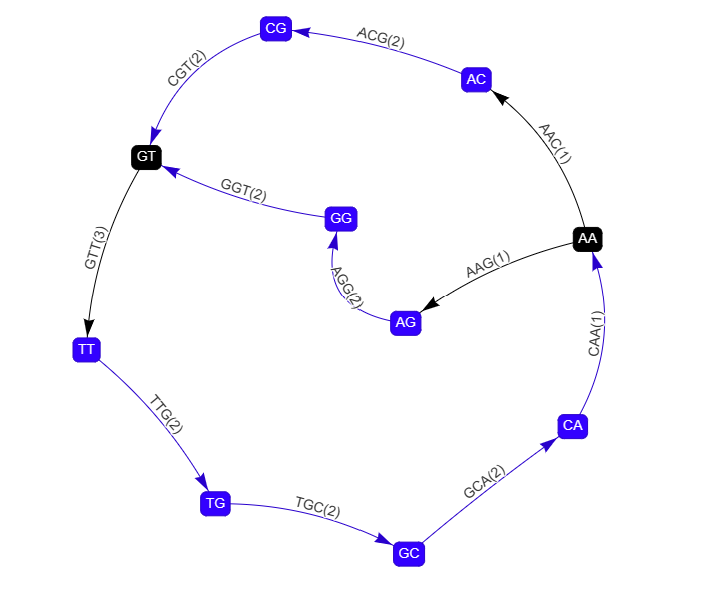

# De-Bruijn-Graph-Genome-Visualization
This is a fork from Andri Shostatskyis De-Bruijn-Graph-Genome-Visualization. The base builds de Bruijn graph from genome reads and visualizes in browser using vis.js. It's meant to be used for relatively small data sets and helps when learning genome sequencing algorithms.

Additionally one can compress the de brujin graph in an interactive way.

In order to use it, simply open index.html, select kmer size, width and height of network canvas, and provide reads of genome; then click on 'Display'. Kmers are displayed as edges between nodes.

#### Example of visualization # 1
Kmer size is 3. Input:
```python
AACG
AAGG
ACGT
AGGT
CGTT
GCAA
GGTT
GTTG
TGCA
TTGC
```
We can observe the graph is cyclic and has one bubble.


#### Example of visualization # 2
Kmer size is 7. Input:
```python
AAAAAAAAAAAAAATATTTTTATTAAATAATTAAAATAAGAAAAAATAAAAA
```
We can observe the graph has bubbles and a tip.


### Example of visualization # 3
We can observe the graph is quite dense, has bubbles and tips.


### Example of graph compaction
for this we use the same graph as in example 1. By clicking the 'Show unitig node button, the Nodes to be compressed are colored blue:



By clicking on 'Display Compact' the compacted representation of the graph is shown, where the unitigs are collapsed.